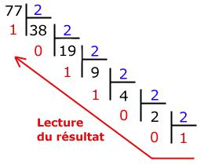

<script type="text/javascript" src="http://cdn.mathjax.org/mathjax/latest/MathJax.js?config=default"></script>

# **Epreuves Pratiques**

## SUJET 21


[Corrigé](corrige.md)


**Exercice 1 (4 points)**

Écrire une fonction python appelée `nb_repetitions` qui prend en paramètres un élément `elt` et une liste `tab` et renvoie le nombre de fois où l’élément apparaît dans la liste.

Exemples :

```Python
>>> nb_repetitions(5,[2,5,3,5,6,9,5])
3
>>> nb_repetitions('A',[ 'B', 'A', 'B', 'A', 'R'])
2
>>> nb_repetitions(12,[1, '! ',7,21,36,44])
0
```

**Exercice 2 (4 points)**

Pour rappel, la conversion d’un nombre entier positif en binaire peut s’effectuer à l’aide des divisions successives comme illustré ici :



Voici une fonction python basée sur la méthode des divisions successives permettant de convertir un nombre entier positif en binaire :

```Python
def binaire(a):
    bin_a = str(...)
    a = a // 2
    while a ... :
        bin_a = ...(a%2) + ...
        a = ...
    return bin_a
```

Compléter la fonction binaire.

Exemples :
```Python
>>> binaire(0)
'0'
>>> binaire(77)
'1001101'
```