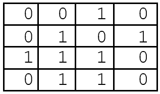
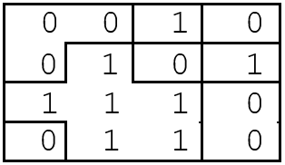
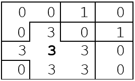

<script type="text/javascript" src="http://cdn.mathjax.org/mathjax/latest/MathJax.js?config=default"></script>

# **Epreuves Pratiques**
## SUJET 25

[Corrigé](corrige.md)

**Exercice 1 (4 points)**

Écrire une fonction `recherche` qui prend en paramètre un tableau de nombres entiers `tab`, et qui renvoie la liste (éventuellement vide) des couples d'entiers consécutifs successifs qu'il peut y avoir dans `tab`.

Exemples :

```Python
>>> recherche([1, 4, 3, 5])
[]

>>> recherche([1, 4, 5, 3]) 
[(4, 5)]

>>> recherche([7, 1, 2, 5, 3, 4]) 
[(1, 2), (3, 4)]

>>> recherche([5, 1, 2, 3, 8, -5, -4, 7]) 
[(1, 2), (2, 3), (-5, -4)]
```


**Exercice 2 (4 points)**

Soit une image binaire représentée dans un tableau à 2 dimensions. Les éléments `M[i][j]`, appelés pixels, sont égaux soit à `0` soit à `1`.

Une composante d’une image est un sous-ensemble de l’image constitué uniquement de `1` et de `0` qui sont côte à côte, soit horizontalement soit verticalement.

Par exemple, les composantes de

M = 

sont

M = 

On souhaite, à partir d’un pixel égal à `1` dans une image `M`, donner la valeur `val` à tous les pixels de la composante à laquelle appartient ce pixel.

La fonction `propager` prend pour paramètre une image `M`, deux entiers `i` et `j` et une valeur entière `val`. Elle met à la valeur `val` tous les pixels de la composante du pixel `M[i][j]` s’il vaut `1` et ne fait rien s’il vaut `0`.

Par exemple, `propager(M,2,1,3)` donne

M = 

Compléter le code récursif de la fonction propager donné ci-dessous :

```Python
def propager(M, i, j, val):
    if M[i][j]== ...:
        return

    M[i][j]=val

    # l'élément en haut fait partie de la composante
    if ((i-1) >= 0 and M[i-1][j] == ...):
        propager(M, i-1, j, val)

    # l'élément en bas fait partie de la composante
    if ((...) < len(M) and M[i+1][j] == 1):
        propager(M, ..., j, val)

    # l'élément à gauche fait partie de la composante
    if ((...) >= 0 and M[i][j-1] == 1):
        propager(M, i, ..., val)

    # l'élément à droite fait partie de la composante
    if ((...) < len(M) and M[i][j+1] == 1):
        propager(M, i, ..., val)

```

Pour `n = 4`, voici ce que l’on devra obtenir :

```Python
>>> M = [[0,0,1,0],[0,1,0,1],[1,1,1,0],[0,1,1,0]]

>>> propager(M,2,1,3)

>>> M
[[0, 0, 1, 0], [0, 3, 0, 1], [3, 3, 3, 0], [0, 3, 3, 0]]
```
