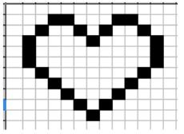
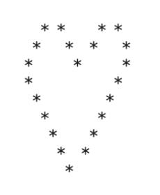
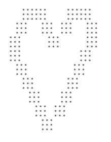

<script type="text/javascript" src="http://cdn.mathjax.org/mathjax/latest/MathJax.js?config=default"></script>

# **Epreuves Pratiques**

## SUJET 27

[Corrigé](corrige.md)

**Exercice 1 (4 points)**

Écrire une fonction `moyenne` prenant en paramètres une liste d’entiers et qui renvoie la moyenne des valeurs de cette liste.

Exemple :

```Python
>>> moyenne([10,20,30,40,60,110])
45.0
```

**Exercice 2 (4 points)**

On travaille sur des dessins en noir et blanc obtenu à partir de pixels noirs et blancs :
La figure « cœur » ci-contre va servir d’exemple.


On la représente par une grille de nombres, c’est-à-dire par une liste composée de sous-listes de mêmes longueurs.
Chaque sous-liste représentera donc une ligne du dessin.

Dans le code ci-dessous, la fonction `affiche` permet d’afficher le dessin. Les pixels noirs (`1` dans la grille) seront représentés par le caractère `"*"` et les blancs (`0` dans la grille) par deux espaces.

La fonction `zoomListe` prend en argument une liste `liste_depart` et un entier `k`. Elle renvoie une liste où chaque élément de `liste_depart` est dupliqué `k` fois.

La fonction `zoomDessin` prend en argument la grille `dessin` et renvoie une grille où toutes les lignes de `dessin` sont zoomées `k` fois et répétées `k` fois.

Soit le code ci-dessous :

```Python
coeur = [[0, 0, 0, 0, 0, 0, 0, 0, 0, 0, 0, 0, 0], \
         [0, 0, 0, 1, 1, 0, 0, 0, 1, 1, 0, 0, 0], \
         [0, 0, 1, 0, 0, 1, 0, 1, 0, 0, 1, 0, 0], \
         [0, 1, 0, 0, 0, 0, 1, 0, 0, 0, 0, 1, 0], \
         [0, 1, 0, 0, 0, 0, 0, 0, 0, 0, 0, 1, 0], \
         [0, 1, 0, 0, 0, 0, 0, 0, 0, 0, 0, 1, 0], \
         [0, 0, 1, 0, 0, 0, 0, 0, 0, 0, 1, 0, 0], \
         [0, 0, 0, 1, 0, 0, 0, 0, 0, 1, 0, 0, 0], \
         [0, 0, 0, 0, 1, 0, 0, 0, 1, 0, 0, 0, 0], \
         [0, 0, 0, 0, 0, 1, 0, 1, 0, 0, 0, 0, 0], \
         [0, 0, 0, 0, 0, 0, 1, 0, 0, 0, 0, 0, 0], \
         [0, 0, 0, 0, 0, 0, 0, 0, 0, 0, 0, 0, 0]]

def affiche(dessin):
    ''' affichage d'une grille : les 1 sont représentés par 
        des "*" , les 0 par deux espaces "  " '''
    for ligne in dessin:
        for col in ligne:
            if col == 1:
                print(" *",end="")
            else:
                print("  ",end="")
        print()


def zoomListe(liste_depart,k):
    '''renvoie une liste contenant k fois chaque 
       élément de liste_depart'''
    liste_zoom = ...
    for elt in ... :
        for i in range(k):
            ...
    return liste_zoom

def zoomDessin(grille,k):
    '''renvoie une grille où les lignes sont zoomées k fois 
       ET répétées k fois'''
    grille_zoom=[]
    for elt in grille:
        liste_zoom = ...
        for i in range(k):
            ... .append(...)
    return grille_zoom
```

Résultats à obtenir :

```Python
>>> affiche(coeur)
```



```Python
>>> affiche(zoomDessin(coeur,3))
```


