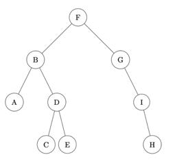

<script type="text/javascript" src="http://cdn.mathjax.org/mathjax/latest/MathJax.js?config=default"></script>

# **Epreuves Pratiques**

## SUJET 28

[Corrigé](corrige.md)

**Exercice 1 (4 points)**

Dans cet exercice, un arbre binaire de caractères est stocké sous la forme d’un dictionnaire où les clefs sont les caractères des nœuds de l’arbre et les valeurs, pour chaque clef, la liste des caractères des fils gauche et droit du nœud.

Par exemple, l’arbre :



est stocké dans

```Python
a = {'F':['B','G'], 'B':['A','D'], 'A':['',''], 'D':['C','E'], 'C':['',''], 'E':['',''], 'G':['','I'], 'I':['','H'], 'H':['','']}
```

Écrire une fonction récursive `taille` prenant en paramètres un arbre binaire `arbre` sous la forme d’un dictionnaire et un caractère `lettre` qui est la valeur du sommet de l’arbre, et qui renvoie la taille de l’arbre à savoir le nombre total de nœud
On pourra distinguer les 4 cas où les deux « fils » du nœud sont `''`, le fils gauche seulement est `''`, le fils droit seulement est `''`, aucun des deux fils n’est `''`.

Exemple :
```Python
>>> taille(a, ‘F’)
9
```


**Exercice 2 (4 points)**

On considère l'algorithme de tri de tableau suivant : à chaque étape, on parcourt depuis le début du tableau tous les éléments non rangés et on place en dernière position le plus grand élément.

Exemple avec le tableau :
<center>`t = [41, 55, 21, 18, 12, 6, 25]`</center>

**Etape 1** : on parcourt tous les éléments du tableau, on permute le plus grand élément avec le dernier. Le tableau devient

<center>`t = [41, 25, 21, 18, 12, 6, 55]`</center>

**Etape 2** : on parcourt tous les éléments sauf le dernier, on permute le plus grand élément trouvé avec l'avant dernier. Le tableau devient :

<center>`t = [6, 25, 21, 18, 12, 41, 55]`</center>

**Et ainsi de suite.**

___

La code de la fonction `tri_iteratif` qui implémente cet algorithme est donné ci-dessous.

```Python
def tri_iteratif(tab):
    for k in range( ... , 0, -1):
        imax = ...
        for i in range(0 , ... ):
            if tab[i] > ... :
                imax = i
        if tab[imax] > ... :
            ... , tab[imax] = tab[imax] , ...
    return tab

```

Compléter le code qui doit donner :

```Python
>>>	tri_iteratif([41, 55, 21, 18, 12, 6, 25])
[6, 18, 12, 21, 25, 41, 55]
```

On rappelle que l’instruction `a, b = b, a` échange les contenus de `a` et de `b`.
