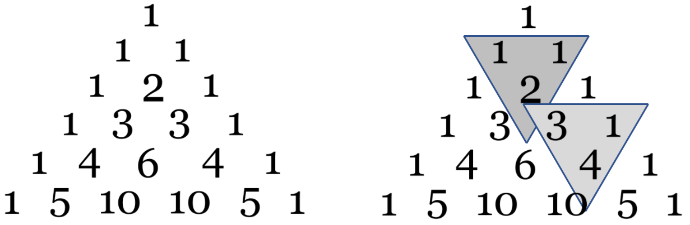

<script type="text/javascript" src="http://cdn.mathjax.org/mathjax/latest/MathJax.js?config=default"></script>

# **Epreuves Pratiques**
## SUJET 9


[Corrigé](corrige.md)


**Exercice 1 (4 points)**

Soit le couple (note,coefficient):
* `note` est un nombre de type flottant (float) compris entre 0 et 20 ;
* `coefficient` est un nombre entier positif.

Les résultats aux évaluations d'un élève sont regroupés dans une liste composée de couples `(note,coefficient)`.

Écrire une fonction moyenne qui renvoie la moyenne pondérée de cette liste donnée en paramètre.

Par exemple, l’expression `moyenne([(15,2),(9,1),(12,3)])` devra renvoyer le résultat du calcul suivant :

$$ \frac{2×15+1×9+3×12}{2+1+3} = 12.5$$


**Exercice 2 (4 points)**

On cherche à déterminer les valeurs du triangle de Pascal. Dans ce tableau de forme triangulaire, chaque ligne commence et se termine par le nombre 1. Par ailleurs, la valeur qui occupe une case située à l’intérieur du tableau s’obtient en ajoutant les valeurs des deux cases situées juste au-dessus, comme l’indique la figure suivante :



Compléter la fonction `pascal` ci-après. Elle doit renvoyer une liste correspondant au triangle de Pascal de la ligne 1 à la ligne n où `n` est un nombre entier supérieur ou égal à 2 (le tableau sera contenu dans la variable `C`). La variable `Ck` doit, quant à elle, contenir, à l’étape numéro k, la k-ième ligne du tableau.


```Python 
def pascal(n):
    C= [[1]]
    for k in range(1,...):
        Ck = [...]
        for i in range(1,k):
            Ck.append(C[...][i-1]+C[...][...] )
        Ck.append(...)
        C.append(Ck)
    return C
```

Pour n = 4, voici ce que l’on devra obtenir :
```Python
>>> pascal(4)
[[1], [1, 1], [1, 2, 1], [1, 3, 3, 1], [1, 4, 6, 4, 1]]
```

Et pour n = 5, voici ce que l’on devra obtenir :
```Python
>>> pascal(5)
[[1], [1, 1], [1, 2, 1], [1, 3, 3, 1], [1, 4, 6, 4, 1], [1, 5, 10, 10, 5, 1]]
```