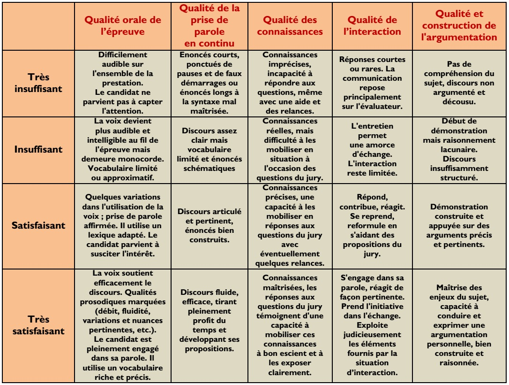

---
hide:
  - toc
---
<link href="../css/zoom.css" rel="stylesheet" />

# **Grand Oral**

## Présentation

<iframe width="560" height="315" src="https://www.youtube.com/embed/3mN9w6rpXgE" title="YouTube video player" frameborder="0" allow="accelerometer; autoplay; clipboard-write; encrypted-media; gyroscope; picture-in-picture" allowfullscreen></iframe>

|  |  |
|--|--|
|Texte du Bulletin Officiel définissant l'épreuve du Grand Oral||
|Modification du Bulletin Officiel du GO (26/09/2023)||
|Présentation du Grand Oral par le ministère (Eduscol)||

!!! success "Définition et objectifs"
    - Épreuve orale  
    - Durée : 20 minutes  
    - Préparation : 20 minutes  
    - Coefficient : 10  
    L'épreuve orale terminale est l'une des cinq épreuves terminales de l'examen du baccalauréat.  
    Elle est obligatoire pour tous les candidats qui présentent l'épreuve dans les mêmes conditions.  
    Les candidats à besoins éducatifs particuliers peuvent demander à bénéficier d'aménagements de l'épreuve conformément à l'annexe 2.

!!! success "Évaluation de l'épreuve"
    L'épreuve est notée sur 20 points.

    Le jury valorise la solidité des connaissances du candidat, sa capacité à argumenter et à relier les savoirs, son esprit critique, la précision de son expression, la clarté de son propos, son engagement dans sa parole, sa force de conviction. Il peut s'appuyer sur la grille indicative suivante :

    

      <input type="checkbox" id="zoomCheck">
      <label for="zoomCheck">
        
      </label>
    

!!! success "Finalité de l'épreuve"

    L'épreuve permet au candidat de montrer sa capacité à prendre la parole en public de façon claire et convaincante. Elle lui permet aussi de mettre les savoirs qu'il a acquis, particulièrement dans ses enseignements de spécialité, au service d'une argumentation.

!!! success "Format et déroulement de l'épreuve"

    L'épreuve, d'une durée totale de 20 minutes, se déroule en deux temps :

    !!! info "Premier temps : présentation d'une question (10 minutes)"
    Au début de l'épreuve, le candidat présente au jury deux questions.

    Ces questions portent sur les deux enseignements de spécialité soit pris isolément, soit abordés de manière transversale. Elles mettent en lumière un des grands enjeux du ou des programmes de ces enseignements. Elles sont adossées à tout ou partie du programme du cycle terminal. Pour les candidats scolarisés, elles ont été élaborées et préparées par le candidat avec ses professeurs et, s'il le souhaite, avec d'autres élèves.

    Les questions sont transmises au jury, par le candidat, sur une feuille signée par les professeurs des enseignements de spécialité du candidat et portant le cachet de son établissement d'origine.

    Le jury choisit une des deux questions. Le candidat dispose de 20 minutes de préparation pour mettre en ordre ses idées et réaliser, s'il le souhaite, un support. Ce support ne fait pas l'objet d'une évaluation. Pour son exposé, le candidat dispose du support qu'il a préparé.

    Le candidat explique pourquoi il a choisi de préparer cette question pendant sa formation, puis il la développe et y répond. 

    Le jury évalue les capacités argumentatives et les qualités oratoires du candidat.

    !!! info "Deuxième temps : échange avec le candidat (10 minutes)"
    Le jury interroge ensuite le candidat pour l'amener à préciser et à approfondir sa pensée. Il peut interroger le candidat sur toute partie du programme du cycle terminal de ses enseignements de spécialité, en lien avec le premier temps de l'épreuve qui lui-même s'adosse à ces enseignements. Le jury évalue ainsi la solidité des connaissances et les capacités argumentatives du candidat.

    Le candidat effectue sa présentation du premier temps debout, sauf aménagements pour les candidats à besoins spécifiques. Pour le second temps de l’épreuve, le candidat est assis ou debout selon son choix. S’il le souhaite, le candidat dispose d’un tableau. 

    Si la question traitée concerne l'enseignement de spécialité langues, littératures et cultures étrangères et régionales, l'épreuve orale terminale peut se dérouler, en partie, dans la langue vivante concernée par l'enseignement de spécialité, selon le choix du candidat.

!!! success "Composition du jury"

    Le jury est composé de deux professeurs de disciplines différentes, dont l'un représente l'un des deux enseignements de spécialité du candidat et l'autre représente un autre enseignement (spécialité ou enseignements communs), ou est professeur-documentaliste. Ils contribuent ensemble à l'évaluation globale du candidat.

!!! success "Aménagements de l'épreuve orale"

    En appliquant les articles D. 351-27 et suivants du Code de l'éducation, les candidats à l'examen du baccalauréat général ou technologique dont les troubles impactent la passation de l'épreuve orale terminale (troubles neurodéveloppementaux, troubles du langage oral ou de la parole, troubles des fonctions auditives, troubles psychiques, troubles des fonctions motrices ou maladies invalidantes, etc.) qui souhaitent bénéficier d'aménagements de l'épreuve orale terminale peuvent en faire une demande selon les procédures en vigueur.

    Les demandes d'adaptation ou d'aménagements peuvent porter particulièrement sur :

    1) Une majoration du temps de préparation ou du temps de passation de l'épreuve ;

    2) Une brève pause en raison de la fatigabilité de certains candidats (déductible du temps de passation) ;

    3) Une accessibilité des locaux et une installation spécifique de la salle ;

    4) Des aides techniques ou du matériel apportés par le candidat ou fournis par l'établissement : utilisation d'une tablette ou d'un ordinateur équipé d'un logiciel spécifique le cas échéant (logiciel de retour vocal par exemple) que l'élève est habitué à utiliser en classe, mais vidé de ses dossiers ou fichiers et hors connexion ;

    5) La communication : le port, par au moins un membre du jury, d'un micro haute fréquence (HF), une énonciation claire et simple des questions en face du candidat afin de faciliter une lecture labiale le cas échéant ou toute autre modalité d'adaptation ;

    6) Les aides humaines :

    un secrétaire reformulant une question ou expliquant un sens second ou métaphorique, rassurant le candidat ou apportant toute autre aide requise ;
    un enseignant spécialisé dans les troubles des fonctions auditives le cas échéant ;
    un interprète en langue des signes française (LSF) ou un codeur en langage parlé complété (LPC).
    7) D'autres adaptations possibles :

    fournir une transcription écrite (avec ou sans aide humaine) pour la présentation orale de la question ;
    répondre par écrits brefs (avec ou sans aide humaine) lors des échanges avec le jury ;
    la présence dans les membres du jury d'au moins une personne maîtrisant la LSF ou le code LPC, le cas échéant, sera préférée à la présence d'un interprète ou d'un codeur ;
    toute autre mesure favorisant les échanges avec le jury et conforme à la réglementation en vigueur.
    La grille d'évaluation indicative ci-jointe doit être prise en compte également pour les élèves à besoins éducatifs particuliers. Le jury veillera à adopter une attitude bienveillante et ouverte afin de permettre d'évaluer les objectifs de l'épreuve dans le respect des compétences spécifiques du candidat.