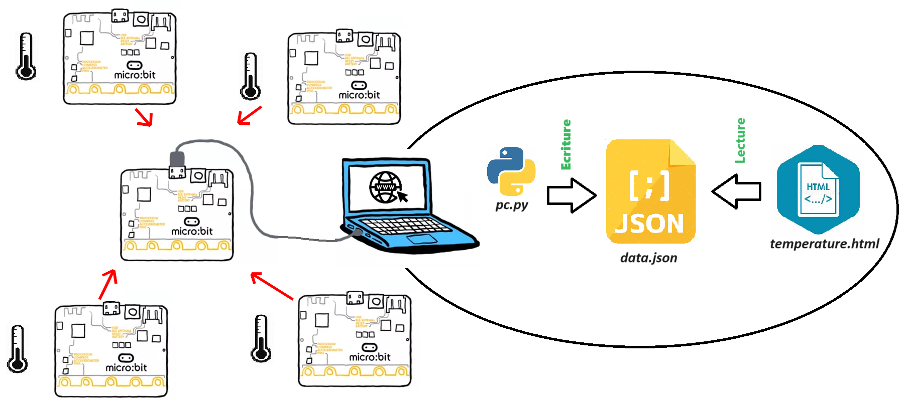

# **P1: Relevé de température 🌡️**  

___

## 📝 Présentation
Le projet consiste à afficher sur une page web les températures relevées dans la salle 307 par des cartes microBit.  
Il se compose de 3 parties :  

* Un serveur web (ordinateur avec Laragon). Il héberge les pages web affichant les données des capteurs.
* Une carte microbit Maître connectée à l'ordinateur par un câble USB. Elle échange avec les microbit esclaves via radio.
* Des cartes microbit Esclave. Elles récupèrent des données du capteur de température et les transmettent sur demande à la carte microbit maitre via radio.

___

## Aperçu du résultat

___

## 📝 CONSIGNES
Mettre en place le serveur Apache de Laragon.
Flasher la carte microBit Maitre.
compléter le programme pc afin d'afficher les valeurs des températures sur la page web.

### 1. Mettre en place le serveur Apache de Laragon.</h3>
La mise en place du serveur consiste à enregistrer les fichiers nécessaires dans le dossier *www* : 

- Lancer Laragon et ouvrez le dossier *www* en cliquant sur le bouton *Dossier www*.
- Télécharger et décompresser <a href="www.zip" target="_blank">ces fichiers</a> dans le dossier *www*.
- Démarrer le serveur.

### 2. Flasher la carte microBit Maitre.
Le programme <a href="maitre.py" target="_blank">`maitre.py`</a> est à télécharger et à ouvrir sur l'<a href="https://python.microbit.org/v/2" target="_blank">IDE microbit en ligne
</a>.

### 3. Modifier le programme `pc.py` afin d'afficher les valeurs des températures sur la page web.

Le programme `pc.py` est un fichier *cgi* destiné à être exécuté sur un serveur web et permet de créer une page web (html) dynamiquement.

___

## 🏆 EN PLUS
Le système peut être amélioré :  

* **- Amélioration 1** : .
* **- Amélioration 2** : .
___

<a href="https://microbit-micropython.readthedocs.io/fr/latest/" target="_blank">Documentation microPython Microbit
</a>

___
