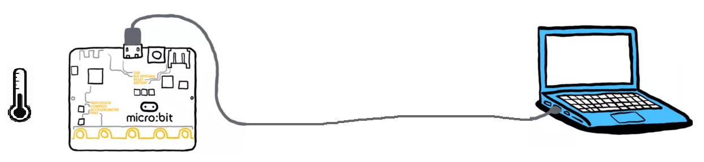

# **P1: Relevé de température 🌡️**  

<table style="border: none;">
  <thead>
    <tr>
      <td align="center" style="color: green; font-weight: bold; font-size: 18px">
        📝 CONSIGNES
      </td>
    </tr>
  </thead>

  <tbody>
    <tr>
      <td>
      La carte microBit relève la température et la transmet à l'ordinateur par la liaison USB.
      Le PC (2nd programme python) réceptionne les données et les affiche dans la console python.
    </td>
    </tr>
    <tr>
      <td>
        

        

      </td>
    </tr>
  </tbody>
</table>

<table style="border: none;">
  <thead>
    <tr>
      <td align="center" style="color: red; font-weight: bold; font-size: 18px">
        🏆 EN PLUS
      </td>
    </tr>
  </thead>

  <tbody>
    <tr>
      <td>
      Le système peut être amélioré :
      * Amélioration 1 : Une seconde carte se charge du relevé de température et la transmet par radio à la première qqui communique avec le PC.
      * Amélioration 2 : L'ordinateur affiche la température et l'enregistre dans un fichier 'csv' affiche la date et l'heure.
    </td>
    </tr>
  </tbody>
</table>

___

Exemple d'écriture sur le port série : <a href="https://sasl56-my.sharepoint.com/:u:/g/personal/mickael_kerviche_sa-sl_fr/EeEU5xTQ82BIgRs76XpQ7VEBtwN90OIwkt-MMshMSTOQxg" target="_blank">`exemple_com-serie_µb.py`
</a> 
Exemple de lecture sur le port série : <a href="https://sasl56-my.sharepoint.com/:u:/g/personal/mickael_kerviche_sa-sl_fr/EWn37BtSWGNJvaH1BjiUnWYBlSV1JZ9YsuftKzIax-Azhw" target="_blank">`exemple_com-serie_PC.py`
</a>

<a href="https://python.microbit.org/v/2" target="_blank">IDE microbit en ligne
</a> 

<a href="https://microbit-micropython.readthedocs.io/fr/latest/" target="_blank">Documentation microPython Microbit
</a>

