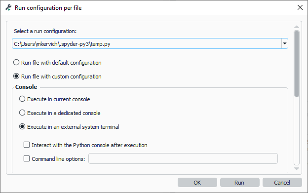

# Jeu de la vie 🧬


## Prérequis

* tableaux à deux dimensions
* fonctions
* modules
* Programmation orientée objet


## Présentation


Je vous propose un mini projet individuel visant à reproduire <a href="https://fr.wikipedia.org/wiki/Jeu_de_la_vie">le jeu de la vie</a> proposé par Conway en 1970.
Le jeu de la vie est ce qu'on appelle un automate cellulaire : c'est un « tableau » dont l'état de chaque case ou cellule dépent de l'état des cases voisines.
À chaque « tour » de jeu, on met à jour l'ensemble des cases en fonction de leurs voisines et on recommence.

Dans le jeu de la vie, chaque cellule peut avoir deux états :

* vivante ;
* morte.

L'état d'une cellule au tour suivant dépend de l'état de ses huit voisins directs.
Il y a deux règles simples qui s'appliquent :

* une cellule morte possédant exactement trois voisines vivantes devient vivante : elle naît ;
* une cellule vivante possédant deux ou trois voisines vivantes le reste, sinon elle meurt.

Si vous voulez des précisions ou en savoir plus allez sur <a href="https://fr.wikipedia.org/wiki/Jeu_de_la_vie">la page Wikipédia du jeu de la vie</a>.


## Travail demandé

Vous allez donc coder le jeu de la vie en utilisant la programmation orientée objet.

### Classe `JeuDeLaVie`

Vous allez créer une classe JeuDeLaVie avec un attribut tableau.
Nous auront besoin de quelques modules, voici donc comment devra commencer votre programme :


```Python
import os
import time
import copy

class JeuDeLaVie:
```
### Constructeur

Le constructeur prendra en argument un tableau à deux dimensions de taille quelconque rempli de `0` et de `1` représentant les cellules.
Un `0` pour une cellule morte et un `1` pour une cellule vivante.
Voici les caractéristiques attendues du constructeur :


```Python
def __init__(self, tableau):
        """
        Affecte un tableau à deux dimensions à l’attribut tableau

        tableau: tableau à deux dimensions
        """
```


### Méthode `affiche()`


Cette méthode doit permettre d'afficher le tableau dans le shell.
On n'utilisera pas d'interface graphique pour simplifier le programme.
Attention, il faudra effacer le contenu du shell avant chaque affichage pour donner l'effet d'une vidéo.
Après avoir importé le module `os` il faut utiliser l'une des commandes suivantes en fonction de votre système d'exploitation :

* pour Windows : `os.system('cls')`


### Autre méthodes

Voici la liste des autres méthodes de la classe JeuDeLaVie avec leurs docstrings qui font office de cahier des charges.

```Python
def run(self, nombre_tours, delai):
        """
        Méthode principale du jeu.

        Fait tourner le jeu de la vie pendant nombre_tours.
        Elle rafraichit l’affichage à chaque tour
        et attend delai entre chaque tour.

        nombre_tours: nombre de tours à effectuer
        delai: temps d’attente en secondes entre chaque tour
        """
```

```Python
def tour(self):
        """
        Met à jour toute les cellules du tableau en respectant les règles
        du jeu de la vie.
        """
```

```Python
def valeur_case(self, i, j):
        """
            Renvoie la valeur de la case [i][j] ou 0 si la case n’existe pas.
        """
```

```Python
def total_voisins(self, i, j):
        """Renvoie la somme des valeurs des voisins de la case [i][j]."""
```

```Python
def resultat(self, valeur_case, total_voisins):
        """
        Renvoie la valeur suivante d’une la cellule.

        valeur_case: la valeur de la cellule (0 ou 1)
        total_voisins: la somme des valeurs des voisins
        return: la valeur de la cellule au tour suivant

        >>> a = JeuDeLaVie([])
        >>> a.resultat(0, 3)
        1
        >>> a = JeuDeLaVie([])
        >>> a.resultat(0, 1)
        0
        >>> a = JeuDeLaVie([])
        >>> a.resultat(0, 4)
        0
        >>> a = JeuDeLaVie([])
        >>> a.resultat(1, 2)
        1
        >>> a = JeuDeLaVie([])
        >>> a.resultat(1, 3)
        1
        >>> a = JeuDeLaVie([])
        >>> a.resultat(1, 1)
        0
        >>> a = JeuDeLaVie([])
        >>> a.resultat(1, 4)
        0
        """
```

### Utilisation du programme


Pour instancier le jeu de la vie et la lancer il faudra alors ajouter ces commandes à la fin de votre fichier :


```Python
tableau =  [[0,0,0,0,0,0,0,0,0,0,0,0,0,0,0,0,0,0,0,0],
           [0,0,0,0,0,0,0,0,0,0,0,0,0,0,0,0,0,0,0,0],
           [0,0,0,1,0,0,0,0,0,0,0,0,0,0,0,0,0,0,0,0],
           [0,0,0,0,1,0,0,0,0,0,0,0,0,0,0,0,0,0,0,0],
           [0,0,1,1,1,0,0,0,0,0,0,0,0,0,0,0,0,0,0,0],
           [0,0,0,0,0,0,0,0,0,0,0,0,0,0,0,0,0,0,0,0],
           [0,0,0,0,0,0,0,0,0,0,0,0,0,0,0,0,0,0,0,0],
           [0,0,0,0,0,0,0,0,0,0,0,0,0,0,0,0,0,0,0,0],
           [0,0,0,0,0,0,0,0,0,0,0,0,0,0,0,0,0,0,0,0],
           [0,0,0,0,0,0,0,0,0,0,0,0,0,0,0,0,0,0,0,0],
           [0,0,0,0,0,0,0,0,0,0,0,0,0,0,0,0,0,0,0,0],
           [0,0,0,0,0,0,0,0,0,0,0,0,0,0,0,0,0,0,0,0],
           [0,0,0,0,0,0,0,0,0,0,0,0,0,0,0,0,0,0,0,0],
           [0,0,0,0,0,0,0,0,0,0,0,0,0,0,0,0,0,0,0,0],
           [0,0,0,0,0,0,0,0,0,0,0,0,0,0,0,0,0,0,0,0],
           [0,0,0,0,0,0,0,0,0,0,0,0,0,0,0,0,0,0,0,0],
           [0,0,0,0,0,0,0,0,0,0,0,0,0,0,0,0,0,0,0,0],
           [0,0,0,0,0,0,0,0,0,0,0,0,0,0,0,0,0,0,0,0],
           [0,0,0,0,0,0,0,0,0,0,0,0,0,0,0,0,0,0,0,0],
           [0,0,0,0,0,0,0,0,0,0,0,0,0,0,0,0,0,0,0,0]]

mon_jeu = JeuDeLaVie(tableau)
mon_jeu.run(100, 0.1)
```

Et pour avoir un affichage correct il sera surement nécessaire de lancer le programme à partir de la ligne de commande :

* > Dans l'invite de commande Windows (`cmd.exe`) :
        ```Shell title=""
        python3 JeuDeLaVie.py
        ```

OU plus simple

* > Dans Spyder : `Run \ Configuration per file...` :
        Modifiez comme ceci :
          
        Spyder exécutera désormais le fichier dans une invite de commande windows où les éléements s'afficheront grâce la fonction `print()`.


L'état initial donné ici devrait faire apparaitre un motif qui se déplace en diagonale.
Voici un autre état initial qui provoque une expension des cellules vivantes :


```Python
tableau =  [[0,0,0,0,0,0,0,0,0,0,0,0,0,0,0,0,0,0,0,0,0,0,0,0,0,0,0,0,0,0,0],
           [0,0,0,0,0,0,0,0,0,0,0,0,0,0,0,0,0,0,0,0,0,0,0,0,0,0,0,0,0,0,0],
           [0,0,0,0,0,0,0,0,0,0,0,0,0,0,0,0,0,0,0,0,0,0,0,0,0,0,0,0,0,0,0],
           [0,0,0,0,0,0,0,0,0,0,0,0,0,0,0,0,0,0,0,0,0,0,0,0,0,0,0,0,0,0,0],
           [0,0,0,0,0,0,0,0,0,0,0,0,0,0,0,0,0,0,0,0,0,0,0,0,0,0,0,0,0,0,0],
           [0,0,0,0,0,0,0,0,0,0,0,0,0,0,0,0,0,0,0,0,0,0,0,0,0,0,0,0,0,0,0],
           [0,0,0,0,0,0,0,0,0,0,0,0,0,0,0,0,0,0,0,0,0,0,0,0,0,0,0,0,0,0,0],
           [0,0,0,0,0,0,0,0,0,0,0,0,0,0,0,0,0,0,0,0,0,0,0,0,0,0,0,0,0,0,0],
           [0,0,0,0,0,0,0,0,0,0,0,0,0,0,0,0,0,0,0,0,0,0,0,0,0,0,0,0,0,0,0],
           [0,0,0,0,0,0,0,0,0,0,0,0,0,0,0,0,0,0,0,0,0,0,0,0,0,0,0,0,0,0,0],
           [0,0,0,0,0,0,0,0,0,0,0,0,0,0,0,0,0,0,0,0,0,0,0,0,0,0,0,0,0,0,0],
           [0,0,0,0,0,0,0,0,0,0,0,0,0,0,0,0,0,0,0,0,0,0,0,0,0,0,0,0,0,0,0],
           [0,0,0,0,0,0,0,0,0,0,0,0,0,0,0,0,0,0,0,0,0,0,0,0,0,0,0,0,0,0,0],
           [0,0,0,0,0,0,0,0,0,0,0,0,0,0,0,0,0,0,0,0,0,0,0,0,0,0,0,0,0,0,0],
           [0,0,0,0,0,0,0,0,0,0,0,0,0,0,1,0,1,0,0,0,0,0,0,0,0,0,0,0,0,0,0],
           [0,0,0,0,0,0,0,0,0,0,0,0,0,0,1,0,1,0,0,0,0,0,0,0,0,0,0,0,0,0,0],
           [0,0,0,0,0,0,0,0,0,0,0,0,0,0,1,1,1,0,0,0,0,0,0,0,0,0,0,0,0,0,0],
           [0,0,0,0,0,0,0,0,0,0,0,0,0,0,0,0,0,0,0,0,0,0,0,0,0,0,0,0,0,0,0],
           [0,0,0,0,0,0,0,0,0,0,0,0,0,0,0,0,0,0,0,0,0,0,0,0,0,0,0,0,0,0,0],
           [0,0,0,0,0,0,0,0,0,0,0,0,0,0,0,0,0,0,0,0,0,0,0,0,0,0,0,0,0,0,0],
           [0,0,0,0,0,0,0,0,0,0,0,0,0,0,0,0,0,0,0,0,0,0,0,0,0,0,0,0,0,0,0],
           [0,0,0,0,0,0,0,0,0,0,0,0,0,0,0,0,0,0,0,0,0,0,0,0,0,0,0,0,0,0,0],
           [0,0,0,0,0,0,0,0,0,0,0,0,0,0,0,0,0,0,0,0,0,0,0,0,0,0,0,0,0,0,0],
           [0,0,0,0,0,0,0,0,0,0,0,0,0,0,0,0,0,0,0,0,0,0,0,0,0,0,0,0,0,0,0],
           [0,0,0,0,0,0,0,0,0,0,0,0,0,0,0,0,0,0,0,0,0,0,0,0,0,0,0,0,0,0,0],
           [0,0,0,0,0,0,0,0,0,0,0,0,0,0,0,0,0,0,0,0,0,0,0,0,0,0,0,0,0,0,0],
           [0,0,0,0,0,0,0,0,0,0,0,0,0,0,0,0,0,0,0,0,0,0,0,0,0,0,0,0,0,0,0],
           [0,0,0,0,0,0,0,0,0,0,0,0,0,0,0,0,0,0,0,0,0,0,0,0,0,0,0,0,0,0,0],
           [0,0,0,0,0,0,0,0,0,0,0,0,0,0,0,0,0,0,0,0,0,0,0,0,0,0,0,0,0,0,0],
           [0,0,0,0,0,0,0,0,0,0,0,0,0,0,0,0,0,0,0,0,0,0,0,0,0,0,0,0,0,0,0]]
```

À vous d'essayer différentes situations initiales pour voir ce qu'il se passe.


### Aides et conseils

#### Délais


Pour faire attendre le programme nous avons besoin du module `time` avec la méthode <a href="https://docs.python.org/fr/3/library/time.html#time.sleep"> `time.sleep()`</a>.


#### Copier un tableau


À un moment donné, vous allez avoir besoin de copier l'attribut tableau de la classe.
Pour avoir une copie indépendante de l'original il vous faudra utiliser la méthode <a href="https://docs.python.org/fr/3/library/copy.html#copy.deepcopy">`copy.deepcopy()`</a> du module `copy`.


### Améliorations


Si vous êtes rapide, vous pouvez apporter des améliorations au programme.
Voici quelques suggestions :


* détecter s'il n'y a plus de changements dans le tableau entre deux tours et arrêter alors le programme ;
* permettre de choisir le symbole représentant une cellule vivante ;
* proposer de choisir parmi des configurations initiales pré-enregistrées ;
* ajouter une interface graphique (pour ceux qui savent le faire). ;
* toute autre idée pour améliorer le programme…


## Tableau du barème

Voilà le barème complet sur 14 pour ce projet.

| Tâche                          | Barème        |
|--------------------------------|---------------|
| Affichage basique              | 1 point       |
| Affichage amélioré             | 1 point       |
| Valeur case                    | 1 point       |
| Total voisins                  | 1 point       |
| Tour                           | 1 point       |
| Run                            | 1 point       |
| Arrêt automatique              | 1 point       |
| Configuration pré-enregistrées | 1 point       |
| Interface graphique [Bonus]    | 1 point bonus |
| Code propre                    | 2 points      |
| Code optimisé                  | 2 points      |
| Commentaires                   | 2 points      |
| Total                          | 14            |


## Ressources pour l'interface graphique

* (Exemple pour créer une grille avec Tkinter)[http://math.univ-lyon1.fr/irem/Formation_ISN/formation_interfaces_graphiques/module_tkinter/exo_canevas.html]
* (Utiliser Tkinter avec la POO)[https://ismvsectioninfo.wordpress.com/2020/09/21/digital-clock-poo-tkinter-gui-avec-sous-menu]