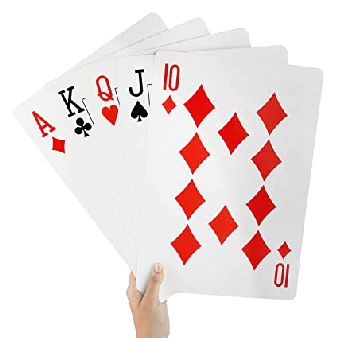
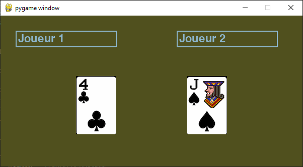

# **P2: Jeu de cartes : la Bataille 🃏♣️♠♥♦ **  
<center></center>

A l'aide aux classes du fichier `classes.py`, créer un jeu de bataille.  
La méthode `getNbCartes`de la classe `Joueur` est à implémenter.

> Rappel des règles : [Wikipédia](https://fr.wikipedia.org/wiki/Bataille_(jeu))

## Exemple d'exécution

```
moi : 5♠   |   toi : 7♣
toi gagne
moi : 5♠   |   toi : 5♥
Bataille :  ['5♠', '5♥']
moi : 3♦   |   toi : 3♠
Bataille :  ['5♠', '5♥', '6♠', 'R♦', '3♦', '3♠']
moi : 8♣   |   toi : 4♥
moi gagne
...

...
moi : 3♣   |   toi : 3♠
Bataille :  ['3♣', '3♠']
moi : 2♥   |   toi : 7♠
toi gagne
toi a gagné
moi a perdu
en 326 coups
```

## Détails du fichier `classes.py`

Fichier <a href="https://sasl56-my.sharepoint.com/:u:/g/personal/mickael_kerviche_sa-sl_fr/Ed7WYFa_dsVOhob7Gcy0ZloBIceaxfeq3u6RmB4MkqlqFw" target="_blank">`classes.py`
</a><br>

### classe `Carte`
```Python
# Attributs de classe :
#   couleurs : les 4 couleurs de cartes
#   valeurs : les 8 valeurs de cartes

couleurs = ["♥", "♦", "♣", "♠"]
valeurs = {"2": 2, "3": 3, "4": 4, "5": 5, "6": 6, "7": 7, "8": 8, "9": 9,
            "10": 10, "V": 11, "D": 12, "R": 13, "A": 14}
    
# Méthodes :
#
def __init__(self, couleur: str, nom: str):
    #   couleur : une des valeur de Carte.couleurs : "♥" ou "♦" ou "♣" ou "♠"
    #   valeurs : une des clés du dictionnaire Carte.valeurs : "2" ou "3" ou "4" ou "5" ou "6" ou "7" ou "8" ou "9" 
    #                                                           ou  "10" ou "V"  ou "D" ou "R" ou "A"

def get_couleur(self):
    # retourne la couleur de la carte : "♥" ou "♦" ou "♣" ou "♠"

def get_couleur_int(self):
    # retourne l'indice de la couleur de la carte dans Carte.couleurs : 0 pour ♥, 1 pour ♦, 2 pour ♣, 3 pour ♠

def get_valeur(self):
    # retourne la valeur de la carte : 2, 3, 4, 5, 6, 7, 8, 9, 10, 11, 12, 13, 14

def get_nom(self):
    # retourne la valeur de la carte parmi les clés de Carte.valeurs : "2" ou "3" ou "4" ou "5" ou "6" ou "7" ou "8" 
    #                                                                  ou "9" ou  "10" ou "V"  ou "D" ou "R" ou "A"

def get_carte(self):
    # retourne la carte sous la forme "valeur + couleurs : par exemples "D♥" ou "10♦"
```

___

### classe `Joueur`

```Python
# Méthodes :
#
def __init__(self, nom: str):
    # nom du joueur,
    # peut_jouer : booléen indiquant s'il reste au joueur des cartes (0 carte : False)

def ramasser(self, cartes: list):
    # Ajoute des cartes à la main du joueur. (dessous le tas)
    # cartes : liste de carte sous la forme "D♥"

def melanger(self):
    # Mélanger les cartes du joueur aléatoirement

def jouer(self)->tuple:
    # Sort la carte du dessus de la pile de cartes.
    # retourne un tuple : (valeur, couleur)

def getNom(self)->str:
    # Retourne le nom du joueur

def getCartes(self)->list:
    # Fournit les cartes détenues par le joueur.

def getNbCartes(self)->int:
    # Indique le nombre de cartes en main.

def setNom(self, nom: str):
    # modifie le nom du joueur
```

___

### classe `JeuDeCartes`
```Python
Classe jeu de cartes:
# Méthodes :
#
def __init__(self):
    # Fonction initialisation : créer un jeu de 52 cartes stockées sous forme d'une liste 'cartes'.
    
def melanger(self):
    # melange le jeu de cartes de façon aléatoire

def distribuer(self, nb_carte: int)->list:
    # Tire un certain nombre de cartes du jeu
    # nb_carte : nombre de carte à tirer.
    # Retourne une liste des cartes tirées.

```

## En plus...

Vous pouvez améliorer le jeu en créant une interface graphique.  

- Remplacez le fichier `classes.py` par ce fichier <a href="https://sasl56-my.sharepoint.com/:u:/g/personal/mickael_kerviche_sa-sl_fr/Ec7bA_ismRJLiDRCXekJarcBh0ovfi190GmK0OuIOVGfsg?e=nj5tAg" target="_blank">`classes_gui.py`
</a><br>

- et ajoutez dans le dossier de votre programme le fichier <a href="https://sasl56-my.sharepoint.com/:u:/g/personal/mickael_kerviche_sa-sl_fr/EUY23SRyvwxJt9i5_W7L3bcBxFdYOVIJzBDqj_prlfM8xA?e=bvMZUl" target="_blank">`graphismes.py`
</a><br>

- Exemple d'utilisation du fichier `graphismes.py` : <a href="https://sasl56-my.sharepoint.com/:u:/g/personal/mickael_kerviche_sa-sl_fr/EadxoR3gPHZIuLd3PWdLm5ABBM_06sDaBg0tZ7jUqD89xQ?e=l8BMBx" target="_blank">`Affiche 1 carte.py`
</a><br>

### Exemple de fenêtre graphique




## **Travail attendu :**


- Une présentation de votre programme sous la forme d'un 'algorithme' en langage naturel.
> Vous réaliserez cette présentation sur une page (document numérique).

- Une présentation orale d'une des parties du programme. (une classe ou une partie d'une classe)
> Vous aurez un temps en classe pour préparer cette présentation accompagnée d'un document à présenter. Vous ferez votre présentation au reste du groupe.


<iframe src="https://trinket.io/embed/python/b474fe3491?outputOnly=true" width="100%" height="356" frameborder="0" marginwidth="0" marginheight="0" allowfullscreen></iframe>