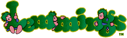
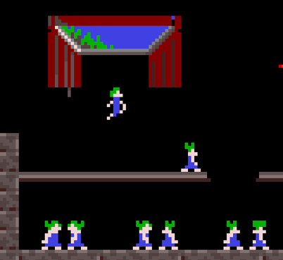
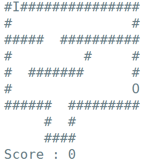

---
hide:
    - toc
---    

# Lemmings 🏃🏻🧍🚶🤸   

> * **Lemmings** est un jeu vidéo de réflexion développé par le studio écossais DMA Design (aujourd’hui Rockstar North) et édité par Psygnosis en 1991.*
> 
> Le joueur doit guider des dizaines de lemmings, minuscules créatures écervelées, dans des niveaux alambiqués truffés de dangers mortels. Le jeu est fondé sur le mythe populaire selon lequel les [lemmings](https://fr.wikipedia.org/wiki/Lemming), petits rongeurs bien réels des régions arctiques, se livreraient au suicide collectif en se jetant des falaises.

<a href="https://www.abandonware-france.org/online/play/lemmings/" target="_blank">Cliquez ici pour jouer !
</a>

Dans ce jeu, les lemmings marchent dans une **grotte** représentée par une grille à deux dimensions dont chaque case est soit un mur soit un espace vide, un espace vide pouvant contenir au maximum un lemming à un instant donné. Les lemmings apparaissent les uns après les autres à une position de départ, et disparaissent lorsqu’ils atteignent une case de sortie.

Chaque lemming possède les propriétés suivantes :

* Sa **position**, donnée par deux coordonnées, désignant la case dans laquelle il se trouve.
* La **direction** dans laquelle il se déplace (gauche ou droite).
Les lemmings se déplacent à tour de rôle, toujours dans l’ordre correspondant à leur introduction dans le jeu, de la manière suivante :

* si l’espace immédiatement en-dessous est libre, le lemming **tombe** d’une case ;
* sinon, si l’espace immédiatement devant est libre (dans la direction du lemming concerné), le lemming **avance** d’une case ;
* enfin, si aucune de ces deux conditions n’est vérifiée, le lemming se **retourne**.
 

On propose, pour réaliser un petit programme permettant de voir évoluer une colonie de lemmings, une structure avec une classe

`Lemming` pour les lemmings, une classe `Case` pour les cases de la grotte, et une classe principale `Jeu` pour les données globales.
 

## Exemple en animation

 

Cette base peut ensuite évidemment être étendue avec des terrains plus variés, de nouvelles possibilités d’interaction pour le joueur, des objectifs en termes de nombre de lemmings sauvés, etc…