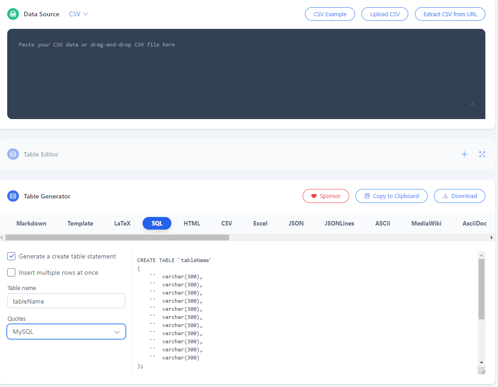

# **P3: Utilisation d'un base de données avec Python**  

## Préparation

* Rendez vous à ces adresses :   
<a href="https://www.data.gouv.fr/fr/" target="_blank">Plateforme ouverte des données publiques françaises
</a> 
<a href="https://www.data.gouv.fr/fr/datasets/communes-de-france-base-des-codes-postaux/" target="_blank">Communes de france - Base des codes postaux
</a> 

* Sélectionnez un (ou plusieurs) jeu de données avec lequel vous travaillerez.

* Sur Heidi SQL, créer une BDD et importer les données récupérées (outils / importer un fichier CSV)
___

## La réalisation

Imaginez une utilisation des données choisies afin de les exploiter avec <a href="https://python-visualization.github.io/folium/index.html" target="_blank">Folium</a>  et éventuellement <a href="https://matplotlib.org/" target="_blank">Matplotlib</a>.

## Compte rendu

Vous rédigerez un compte rendu qui présente :  

* les données choisies,  
* le schéma relationnel de votre BDD,  
* l’exploitation prévue avec les données choisies,  
* la partie de votre programme réalisant le traitement,  
* un exemple d’exécution (avec les données d’entrée et le résultat obtenu).

## Compte oral

* Quelles sont les données ?
* Qu'avez-vous envisagé de présenter ? 
* Sous quelle forme ? (histogramme, courbe, carte, ...)
* Ou en êtes-vous ?
* Quelle(s) est(sont) la(les) prochaine(s) tâche(s) ?

## Outils

### Conversion CSV --> SQL
<a href="https://tableconvert.com/csv-to-sql" target="_blank">Tableconvert</a> : outil pour convertir un fichier 'csv' en requête 'SQL'.

* Copier/Coller le fichier 'csv' dans la zone 'DataSource'
* Dans la zone 'TableGenerator', sélectionner Quotes : MySQL.
* Récupérer la requête SQL qui a été générée.

### Coordonnées contours communes, départements, régions en france

Données issues du site <a href="https://france-geojson.gregoiredavid.fr/" target="_blank">France-Geojson</a>.  
L'ensemble des données est disponible à cette adresse : <a href="https://github.com/gregoiredavid/france-geojson" target="_blank">https://github.com/gregoiredavid/france-geojson</a>

*clic droit / enregistrer la cible sous*

* <a href="https://raw.githubusercontent.com/gregoiredavid/france-geojson/master/communes.geojson"  download="communes.geojson" target="_blank">Communes</a>
* <a href="https://raw.githubusercontent.com/gregoiredavid/france-geojson/master/communes-version-simplifiee.geojson" download="communes-version-simplifiee.geojson" target="_blank">Communes (version simpliée)</a>
* <a href="https://raw.githubusercontent.com/gregoiredavid/france-geojson/master/departements.geojson" download="departements.geojson" target="_blank">Départements</a>
* <a href="https://raw.githubusercontent.com/gregoiredavid/france-geojson/master/departements-version-simplifiee.geojson" download="departements-version-simplifiee.geojson" target="_blank">Départements (version simplifiée)</a>
* <a href="https://raw.githubusercontent.com/gregoiredavid/france-geojson/master/regions.geojsonRégions" download="regions.geojsonRégions" target="_blank">Régions</a>
* <a href="https://raw.githubusercontent.com/gregoiredavid/france-geojson/master/regions-version-simplifiee.geojson" download="regions-version-simplifiee.geojson" target="_blank">Régions (version simplifiée)</a>