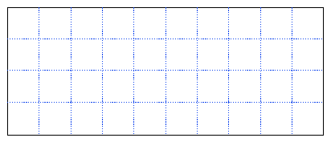
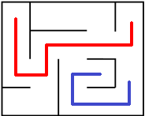
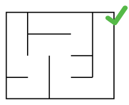
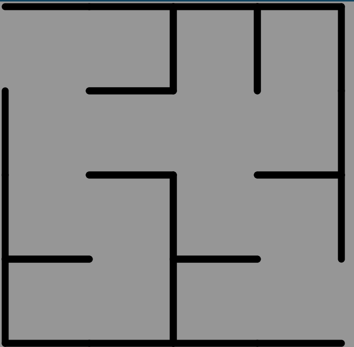
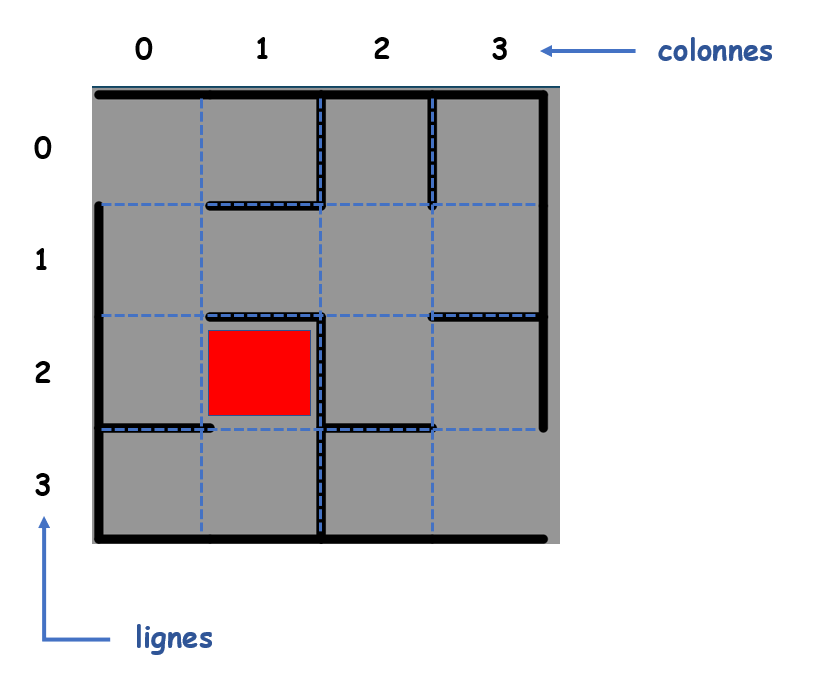
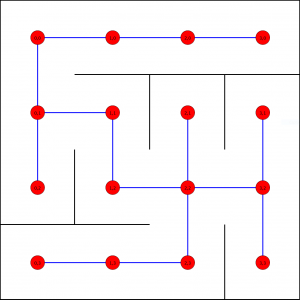

# **P4: Résolution de labyrinthe par les graphes**  


*<center>Le but du projet est résoudre des labyrinthes générés aléatoirement. Les labyrinthes peuvent être vus comme des graphes.</center>*

___

<h2 class="titre">Propriétes des labyrinthes</h2>
Nous nous intéresserons seulement à des labyrinthes rectangulaires composés de n lignes et m colonnes sur une grille régulière composée de n×m cellules. Chaque cellules comportant 4 côtés dont chacun peut être ouvert ou fermé (présence d'un mur).

<center>
  
  <figcaption>grille vide avec murs extérieurs</figcaption>
</center>

> * Deux cellules sont consécutives si elles partagent un côté.
> * Un chemin dans un labyrinthe est une suite finie de n cellules où chacune est consécutive avec sa suivante.
> * Un labyrinthe est dit parfait s'il existe un et un seul chemin connectant 2 cellules.
> 
> |Exemple 1|Exemple 2|Exemple3|
> |:-:|:-:|:-:|
> ||| |
> |<figcaption>Chemin</figcaption>|<figcaption>plusieurs chemins</figcaption>|<figcaption>parfait</figcaption>|


!!! note  
    Montrer que pour un labyrinthe rectangulaire de n lignes et m colonnes le nombre maximal de murs internes fermés est : $2 n m - n - m$


## <span class='titre'>Création d'un labyrinthe</span>

La création d'un labyrinthe suit les étapes suivantes: 

1. Générer un graphe G représentant une grille de taille m*n  
1. Construire un <b>arbre couvrant</b> A de ce graphe  
1. Dessiner le labyrinthe en traçant un mur entre les sommets directement liés dans G et non dans A  

___  
### <span class='titre'>1. Générer une grille de taille m * n</span>

Un labyrinthe, composé de longueur × largeur cases numérotées par des couples (i, j), est représenté par un graphe (non orienté) dont les sommets sont étiquetés par des couples (i, j). Lorsqu’une case (i0, j0) communique avec une autre case voisine (i1, j1), alors il existe une arête entre les sommets (i0, j0) et (i1, j1) du graphe. Deux cases (ou sommets) sont particuliers, ce sont l’entrée (0,0) et la sortie du labyrinthe.  
Soit le labyrinthe suivant :

#### Présentation de la structure de données représentant la géométrie d'un labyrinthe
Le labyrinthe de taille 4x4 suivant :  
<center></center>  
est représenté par la matrice Python suivante :

```Python
grille = 
[[[False, True, True, True], [False, False, False, True], [ False, False, True, False], [ False, False, True, False]],
[[ True, True, True, False], [ False, True, False, True], [ True, True, True, True], [ True, False, False, True]],
[[ True, True, False, False], [ False, False, True, True], [ True, True, False, False], [ False, False, True, True]],
[[ False, True, False, False], [ True, False, False, True], [ False, True, False, False], [ True, True, False, True]]]
```

Il s'agit d'une matrice de dimension 4x4 et l'élément `grille[i][j]`, `i` et `j` étant deux entiers compris entre 0 et 3, décrit la géométrie de la case à l'intersection de la ligne `i` et de la colonne `j`.

Exemple :  
`une_case = grille[2][1] = [False, False, True, True]` correspond à la case du labyrinthe à l'intersection de la ligne `2` et de la colonne `1`.
<center></center>

Description des éléments de la liste représentant `une_case = [False, False, True, True]`:  

* Indice 1 : valeur `False` : booléen qui indique ici la <b>présence</b> d'un mur <b>en haut</b> de la case est présent.
* Indice 2 : valeur `False` : booléen qui indique ici la <b>présence</b> d'un mur <b>à droite</b> de la case est présent.
* Indice 3 : valeur `True` : booléen qui indique ici l'<b>absence</b> de mur <b>en bas</b> de la case est présent.
* Indice 4 : valeur `True` : booléen qui indique ici l'<b>absence</b> de mur <b>à gauche</b> de la case est présent.
___  
### 2. Construire un <b>arbre couvrant</b> A de ce graphe

#### Qu'est ce qu'un arbre couvrant ?
Un <b>arbre</b> est un graphe à la fois connexe et sans cycle. Un <b>arbre couvrant</b> d'un graphe est un arbre inclus dans ce graphe et qui connecte tous les sommets du graphe.
<center></center>

En plaçant un sommet sur chaque cellule de notre labyrinthe, et en reliant deux sommets par une arête si leurs cellules sont séparées par une porte, il devient possible de dessiner un arbre à partir de n'importe quel labyrinthe.  

Sur notre graphe, un arête est donc un passage dans notre labyrinthe.

<center></center>


!!! note  
    Représenter l'arbre du graphe ci-dessus avec en étiquette les coordonnées de chaque noeud.


#### constuire l'arbre binaire
De nombreux algorithmes existent répartir toutes ces portes de manière à ce que toutes les cellules soient accessibles et qu'il n'existe qu'un unique chemin entre l'entrée et la sortie, dont le parcours en profondeur et l'algorithme de Kruskal. Chaque algorithme est différent et produit des labyrinthes visuellement différents.

<center>

<p>L'algorithme du parcours en profondeur (ou "recursive backtracker" en anglais) commence sur une cellule aléatoire dans le labyrinthe.
Il suffit ensuite de se diriger dans une direction aléatoire et de casse le mur face à soi, tout en marquant la cellule précédente comme visitée.
Lorsque plus aucune direction n'est disponible, l'algorithme "remonte" à la position précédente : c'est le backtracking.</p>
</center>

___  
## Cahier des charges :

Le modèle de représentation afin de modéliser des labyrinthes rectangulaires est une classe `Labyrinthe` qui contiendra les <i>méthodes</i> et les <i>attributs</i> suivants :
 
* un <b>constructeur</b> : `__init__(self, largeur, hauteur)`  
* des <strong>attributs</strong> :  `self.largeur`, le nombre de colonnes de la grille et `self.hauteur`, le nombre de lignes définis dans le constructeur
* un <strong>attribut</strong> :  `self.grille` représentant les cellules du labyrinthe.  

Écrire la méthode solution de la classe Labyrinthe (un parcours en profondeur) renvoyant un chemin permettant de se rendre d’une cellule de départ à une cellule d’arrivée. Vous testerez votre code dans le fichier <a href="../labyrinthe.py" target="_blank">labyrinthe.py</a>.


___ 
## Le code du programme :

```Python
class Cellule:
	def __init__(self):
		self.mur_bas = True # True signifie que le mur est fermé
		self.mur_droit = True # False signifie que le mur est ouvert


class Labyrinthe:
	def __init__(self, largeur, hauteur):
		self.hauteur = hauteur
		self.largeur = largeur
		self.grille = [[Cellule() for j in range(largeur)] for i in range(hauteur)]
		self.generation()
	
	def solution(self, depart_ligne, depart_colonne, arrivee_ligne, arrivee_colonne):
		"""
		Renvoie la liste de directions à suivre pour se rendre de la cellule
		(depart_ligne, depart_colonne) à la cellule (arrivee_ligne, arrivee_colonne).
		Exemple de retour : ['n', 'e', 'e', 's', 'o']
		"""
```


<iframe src="https://trinket.io/embed/python/e25159be66?outputOnly=true" width="100%" height="356" frameborder="0" marginwidth="0" marginheight="0" allowfullscreen></iframe>

<iframe src="https://trinket.io/embed/python/e27dfa9f4d?outputOnly=true" width="100%" height="356" frameborder="0" marginwidth="0" marginheight="0" allowfullscreen></iframe>