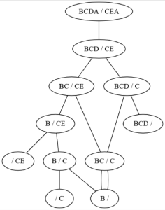

---
hide:
    - toc
---    

# **Plus longue sous-séquence**  

On cherche dans ce TP à calculer la plus longue sous-séquence (PLSS) de deux chaînes de caractères. Par cela on entend la plus longue chaîne de caractères que l’on peut obtenir à partir des deux chaînes en supprimant certains de leurs caractères (pas obligatoirement les mêmes).

Notez bien que :

* l’on peut supprimer des caractères mais que l’on ne change pas l’ordre des caractères restants
* la longueur de la PLSS de deux chaînes est unique mais il peut exister plusieurs chaînes de cette longueur

Par exemple, pour les chaînes ABCBDAB et BDCABA, la longueur maximale des PLSS est 4 et l’une d’entre elles est BDAB. En effet :

A<b>B</b>CB<b>DAB</b> --> BDAB et <b>BD</b>C<b>AB</b>A --> BDAB

## Partie A : Approche « Force-Brute »
L’approche « Force Brute » consiste à énumérer toutes les sous-séquences de chacune des deux chaînes et à les comparer entre elles.

Considérons les chaînes BACB et BCB. Les sous séquences de la première chaîne sont :

| Sous séquence<br><br>de longueur 0 | Sous séquences de longueur 1 |      Sous séquences de longueur 2   | Sous séquences de longueur 3 | Sous séquences de longueur 4 |
|:--------------------------------- :|: -------------------------- :|: --------------------------------- :|: -------------------------- :|: -------------------------- :|
|                ∅                   |  B A<br><br>C B<br><br><br>  | BA BC<br><br>BB AC<br><br>AB CB<br> |     BAC BAB<br><br>BCB ACB   |              BACB            |

Il y en a donc 16 différentes (y compris la vide).
___

!!! question  
    1.Lister toutes les sous-séquences de la seconde chaîne BCB.

!!! question  
    2.Quelle est la sous-séquence de longueur maximale ?

!!! question  
    3.Combien de sous-séquences compte une chaîne de caractères tous différents ? On ne demande pas de justification exacte mais l’on pourra s’appuyer sur les tableaux.

!!! question  
    4.Pourquoi une telle méthode est-elle infaisable en pratique lorsque les chaînes de caractères sont de grande taille ?


## PPartie B : Programmation dynamique

Considérons deux chaînes X et Y de longueurs respectives m et n.

Soit PLSS la fonction qui prend en argument deux chaînes `X, Y` et qui renvoie la PLSS de X et Y.

Par exemple `PLSS("ABCBDAB", "BDAB")` est égale à `BDAB` (voir l’exemple du début de l’exercice).

La résolution du problème à l’aide de la programmation dynamique envisage deux cas de figures :

Le dernier caractère des deux chaînes est le même `(X[-1] == Y[-1])` :

Dans ce cas, comme les derniers caractères coïncident, on peut étudier les sous chaînes sans ce dernier caractère et ajouter le dernier caractère au résultat.

La PLSS est égale à : `PLSS(X[:-1], Y[:-1]) + PLSS[-1]`

On a donc par exemple : `PLSS("ABCD","CFD") = PLSS("ABC","CF") + X[-1]`

Remarque : on rappelle qu’en python, `X[-1]` est le dernier caractère d’une chaîne et l’appel `X[:-1]` renvoie la chaîne `X` privée de son dernier caractère

Les deux derniers caractères ne correspondent pas (`X[-1] != Y[-1]`) :

Dans ce cas il faut étudier deux sous-problèmes :

celui dans lequel on a ôté le dernier caractère de `X` sans changer `Y`

celui dans lequel on a ôté le dernier caractère de `Y` sans changer `X`

On retient le meilleur des deux cas en comparant les longueurs des résultats.

On a donc par exemple :

```Python
sol_x = PLSS("AB","CF")
sol_y = PLSS("ABC", "C")
if len(sol_x) >= len(sol_y) :
    PLSS("ABC","CF") = sol_x
else 
    PLSS("ABC","CF") = sol_y
```

Les appels récursifs ont un cas de base qui est atteint lorsque l’une des deux chaînes est de longueur 0. Dans ce cas la longueur de la PLSS vaut 0.

Cette approche a toutefois un inconvénient : certains des cas de figure sont étudiés plusieurs fois…

Afin de pallier à ce soucis on crée un dictionnaire M qui à chaque couple (chaîne1, chaîne2) associe la longueur de la PLSS. Ce dictionnaire sera une variable « globale » qui pourra donc être lue et modifiée par chacun des appels récursifs.




!!!Note:
    Remarque : on pourrait aussi comparer les premiers caractères de la chaîne au lieu des derniers


On fournit le pseudo code incomplet suivant :

```
    mémoire est un dictionnaire vide

    Fonction PLSS(X : chaîne, Y : chaîne) -> chaîne:
        Si longueur(……………) == 0 OU ……………………………………… :
            Renvoyer ……………
        Sinon :
            Si (X,Y) ne fait pas partie des clés de ………………………… :
                Si …………[-1] == ………………………… :
                    mémoire[(X,Y)] = …………………………………………………………………………
                Sinon :
                    sol_x = ………………………………………………………………………………
                    ……………………………………………………………………………………………………
                    Si ……………………………………………………………………………… :
                        mémoire[……………] = …………………………………………………………………
                    Sinon :
                    …………………………………………………………………………………………………………………
        Renvoyer mémoire[(X,Y)]
```


!!! question  
    1.Compléter cet algorithme.


!!! question  
    2.Coder cet algorithme en python.  
    On pourra effectuer les tests suivants :
    
    | X = …         | Y = …         | PLSS(X, Y) = … |
    |:-------------:|:-------------:|:--------------:|
    | ABCBDAB       | BDCABA        | BDAB           |
    | ∅             |  BDCABA       | ∅              |
    | ABCBDABCBDAB  | BDCABA        | BDCBA          |
    | ABCBDABCBDAB  | ABCBDABCBDAB  | ABCBDABCBDAB   |
