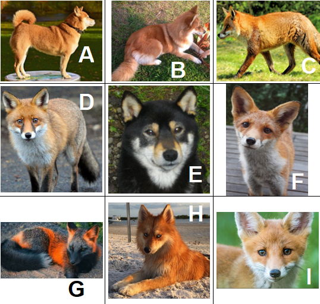

## **Algorithme des K plus proches voisins**

## Recherche par apprentissage
<iframe width="560" height="315" src="https://www.youtube.com/embed/EUD07IiviJg" title="YouTube video player" frameborder="0" allow="accelerometer; autoplay; clipboard-write; encrypted-media; gyroscope; picture-in-picture" allowfullscreen>Le Machine Learning</iframe>

<a href="https://sasl56-my.sharepoint.com/:w:/g/personal/mickael_kerviche_sa-sl_fr/Ea4aA4zjPT9NgJGdXkoRrF8BCnzmVuuGwD1NIgJzfgsedg?e=a2l41e" target="_blank">Document de cours</a>

### A.1 premier exemple

### A.2. KNN en exemple

<a href="personnages.csv" target="_blank">données personnages, fichier csv  </a>

<a href="KNN" target="_blank">Bloc Notes Jupyter, Codes Python</a>

