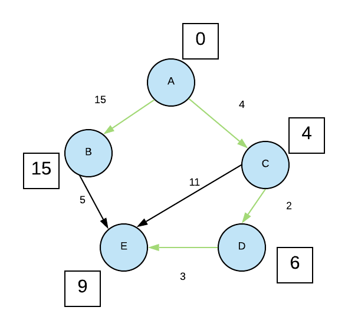

# **A2 : Algorithme sur les graphes**

<center></center>

<a href="https://sasl56-my.sharepoint.com/:w:/g/personal/mickael_kerviche_sa-sl_fr/EaTpwp12EjRLp9K0cNtAyAQBSgsmXjM6x7nhSOFjy3oIRg?e=gNUr59" target="_blank">Document de cours</a>


## Parcours d’un graphe en largeur d'abord : (Pseudo-code)
> *Pour tester votre algorithme, il est plus simple de d'impléter un graphe exemple sous la forme d'une liste d'adjacence.*

``` 
VARIABLES
depart : noeud (origine)
graph : un graphe (liste des voisins)
noeud : noeud
voisin : noeud
file : file (liste vide au départ)
visites : liste
nonvisites : liste
 
DEBUT
bfs(graph, depart) :
visites ← liste vide
chemin  ← liste vide
enfiler depart dans chemin
 
TANT QUE chemin n'est pas vide :
  noeud ← defiler(chemin)
  
  SI noeud n'appartient pas à visites :
          ajouter noeud à visites
          nonvisites ← listes des voisins de noeud non visités
  
          POUR chaque s dans nonvisites :
                  ajouter s dans chemin à la 1ère position 
          FIN POUR
  FIN SI
FIN TANT QUE
 
Renvoyer visites
FIN
```
```Python
def bfs(graph, depart):
    visited = []
    file=[]
    file.append(depart)

    while file:
        node = file.pop()

        if node not in visited:
            visited.append(node)
            unvisited = [n for n in graph[node] if n not in visited]

            for s in unvisited:
                file.insert(0, s)
                
    return visited

ma_liste = {'A': ['B', 'C'],
            'B': ['A', 'D', 'E'],
            'C': ['A', 'D'],
            'D': ['B', 'C', 'E'],
            'E': ['B', 'D', 'F', 'G'],
            'F': ['E', 'G'],
            'G': ['E', 'F', 'H'],
            'H': ['G']}

print(bfs(ma_liste, 'E'))
```
## Parcours d’un graphe en profondeur d'abord : (Pseudo-code)
> *Pour tester votre algorithme, il est plus simple de d'impléter un graphe exemple sous la forme d'une liste d'adjacence.*

``` 
VARIABLES
graph: un graphe (liste des voisins)
depart : noeud
voisin : noeud
 
DEBUT
dfs(graph, depart, visites = None) :
        SI visites est None :
                visites ← liste vide
        FIN SI
        
        Ajouter depart à visites
        
        POUR chaque voisin de depart :
                SI voisin n est pas visité :
                        dfs(graph, voisin, visites)
                FIN SI
        FIN POUR
 
Renvoyer visites
FIN
```
```Python
def bfs(graph, depart):
    visited = []
    file=[]
    file.append(depart)

    while file:
        node = file.pop()

        if node not in visited:
            visited.append(node)
            unvisited = [n for n in graph[node] if n not in visited]

            for s in unvisited:
                file.insert(0, s)
                
    return visited


def pfs(graph, depart, visited=None):
    if visited==None:
        visited = []
        
    visited.append(depart)
    
    for v in graph[depart]:
        if v not in visited:
            pfs(graph, v, visited)
            
    return visited

ma_liste = {'A': ['B', 'C'],
            'B': ['A', 'D', 'E'],
            'C': ['A', 'D'],
            'D': ['B', 'C', 'E'],
            'E': ['B', 'D', 'F', 'G'],
            'F': ['E', 'G'],
            'G': ['E', 'F', 'H'],
            'H': ['G']}

print(pfs(ma_liste, 'E'))
print(bfs(ma_liste, 'E'))
```

## Recherche du chemin le plus court : Algorithme de Dijkstra 

<iframe width="560" height="315" src="https://www.youtube.com/embed/MybdP4kice4" title="YouTube video player" frameborder="0" allow="accelerometer; autoplay; clipboard-write; encrypted-media; gyroscope; picture-in-picture" allowfullscreen></iframe>



Dans le programme suivant, la fonction `deque` importée du module `collections` représente une fil à double entrée. C'est- à dire qu'il est possible d'enfiler et de défiler à gauche comme à droite.
> [Documentation officielle](https://docs.python.org/fr/3/library/collections.html#collections.deque)  
> [Présentation plus simple](http://pascal.ortiz.free.fr/contents/python/structures_de_donnees/les_deques.html)

```Python
from collections import deque

def dijkstra(graph, vertex):
    queue = deque([vertex])
    distance = {vertex: 0}
    while queue:
        t = queue.popleft()
        print("On visite le sommet " + str(t))
        for voisin in graph[t]:
                queue.append(voisin)
                nouvelle_distance = distance[t] + graph[t][voisin]
                if(voisin not in distance or nouvelle_distance < distance[voisin]):
                    distance[voisin] = nouvelle_distance
                    print("Met à jour le sommet " + str(voisin) + " avec la distance : " + str(nouvelle_distance))
                    
    return distance
#Liste d'ajacence du graphe
graph = {'A':{'B':15,'C':4},'B':{'E':5},'C':{'E':11,'D':2},'D':{'E':3},'E':{}}
distance = dijkstra(graph,'A')
print("Distances" + str(distance))

```

*Sortie de l'exécution du programme*

```
On visite le sommet A
Met à jour le sommet B avec la distance : 15
Met à jour le sommet C avec la distance : 4
On visite le sommet B
Met à jour le sommet E avec la distance : 20
On visite le sommet C
Met à jour le sommet E avec la distance : 15
Met à jour le sommet D avec la distance : 6
On visite le sommet E
On visite le sommet E
On visite le sommet D
Met à jour le sommet E avec la distance : 9
On visite le sommet E
Distances{'A': 0, 'B': 15, 'C': 4, 'E': 9, 'D': 6}
```


### A faire :
Modifier la fonction `dijkstra` pour qu'elle renvoie le chemin le plus court d'un sommet de *départ* à un sommet *arrivé*.

Exemple :
```Python
dijkstra(graph,'A', 'E')
>>> ['A', 'C', 'D', 'E']
```