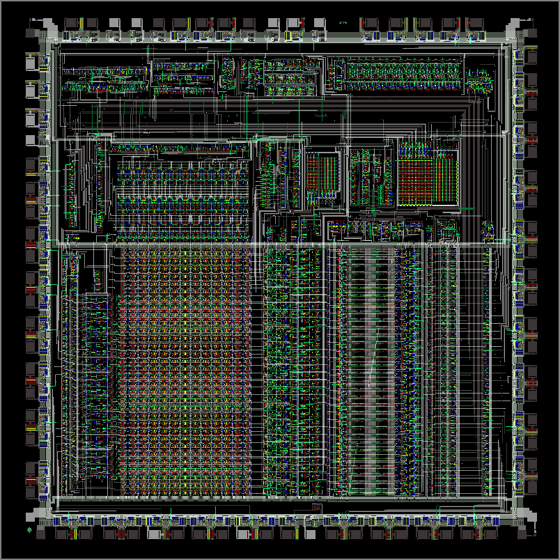

# **AMSER1 - Composants intégrés d’un système sur puce (SOC)**

## Des monstres à apprivoiser : les ordinateurs

En 1966, dans le centre de calcul de La Gaude (IBM), le directeur présente un ordinateur, machine de grande taille, qui permet d'effectuer des calculs et des opérations logiques de façon extrêmement rapide.

<iframe allow="autoplay" title="Vidéo ina.fr: Des monstres à apprivoiser : les ordinateurs" src="https://enseignants.lumni.fr/export/player/00000000632" width="100%" height="100%" allowfullscreen></iframe>

## Les transistors et la miniaturisation de l'ordinateur

En 1969, dans l'usine IBM de Corbeil-Essonnes, le directeur technique montre les différentes étapes de miniaturisation des composants de l'ordinateur franchies en dix ans, avec l'utilisation du transistor et du circuit intégré.

<iframe allow="autoplay" title="Vidéo ina.fr: Les transistors et la miniaturisation de l'ordinateur" src="https://enseignants.lumni.fr/export/player/00000000640" width="100%" height="100%" allowfullscreen></iframe>

## Intel: The Making of a Chip with 22nm/3D Transistors

This video shows the process of how computer chips are made using Intel's world leading 22nm manufacturing technology with 3D transistors. It starts with common sand and shows the most important manufacturing steps until the computer chip (here a 3rd Gen Intel Core processor) is ready for sale.

Cette vidéo montre le processus de fabrication des puces informatiques à l'aide de la technologie de fabrication 22 nm d'Intel avec des transistors 3D. Il commence par du sable ordinaire et montre les étapes de fabrication les plus importantes jusqu'à ce que la puce informatique (ici un processeur Intel Core de 3e génération) soit prête à la vente.

<iframe width="560" height="315" src="https://www.youtube.com/embed/d9SWNLZvA8g" title="YouTube video player" frameborder="0" allow="accelerometer; autoplay; clipboard-write; encrypted-media; gyroscope; picture-in-picture" allowfullscreen></iframe>

## Zoom Into a Microchip

The inside of a microchip is a mysterious thing. Here, we zoom into a microchip using a digital SLR camera then we transition to a scanning electron microscope, aka SEM. Although this is an older microchip, many of the same principles still apply to microchip design but with much, much smaller structures measured in nanometers instead of microns.

L'intérieur d'une puce électronique est une chose mystérieuse. Ici, nous zoomons sur une micropuce à l'aide d'un appareil photo reflex numérique, puis nous passons à un microscope électronique à balayage, alias SEM. Bien qu'il s'agisse d'une micropuce plus ancienne, bon nombre des mêmes principes s'appliquent toujours à la conception de micropuces, mais avec des structures beaucoup, beaucoup plus petites mesurées en nanomètres au lieu de microns.

<iframe width="560" height="315" src="https://www.youtube.com/embed/Knd-U-avG0c" title="YouTube video player" frameborder="0" allow="accelerometer; autoplay; clipboard-write; encrypted-media; gyroscope; picture-in-picture" allowfullscreen></iframe>

.png)

<a href="https://sasl56-my.sharepoint.com/:w:/g/personal/mickael_kerviche_sa-sl_fr/ETt7UVOjdRlBnGJcX9K_Sw8BRDJKq9-kRKM1vwRYrNpXkQ?e=hf5sFs
" target="_blank">Document de cours</a>