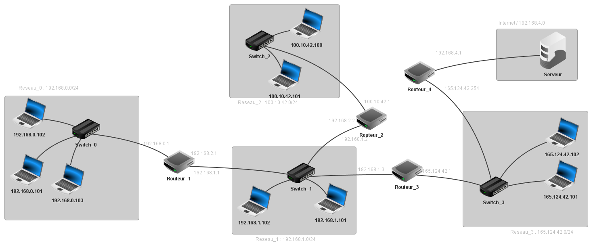
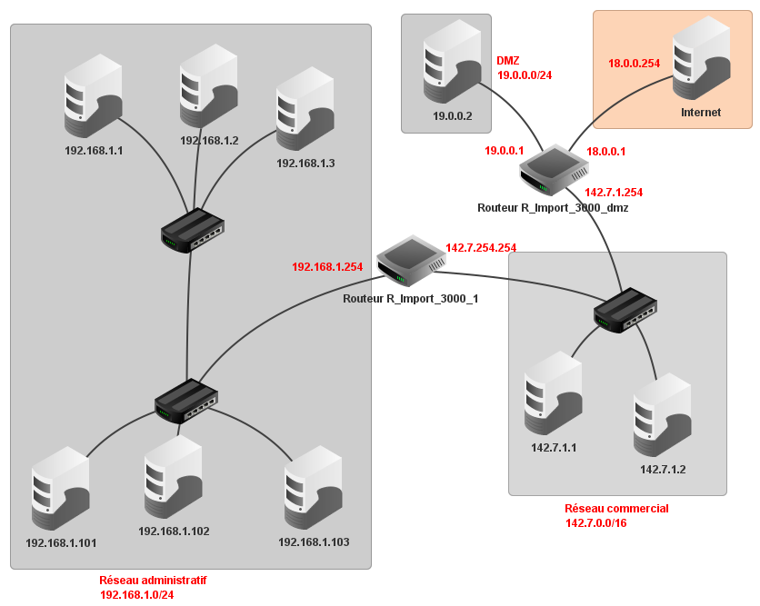

# **AMSER3 - Protocoles de routage**

Se connecter à votre compte office365 pour visualiser les vidéos

## Introduction - Internet, IP un protocole universel ?

<video width="560" height="315" controls>
	<source src="https://sasl56-my.sharepoint.com/personal/mickael_kerviche_sa-sl_fr/_layouts/15/download.aspx?SourceUrl=%2Fpersonal%2Fmickael_kerviche_sa-sl_fr%2FDocuments%2FNSI%2FCours_T%2F4-Architectures+mat%C3%A9rielles%2C+syst%C3%A8mes+d%27exploitation+et+r%C3%A9seaux%2FARSE3%2FInternet%2C+IP+un+protocole+universel+.mp4&ccat=0&correlationid=ef9ecd65-adad-418d-ad42-cde2ddfaa35c" type="video/mp4">
</video>

Après avoir visionné la vidéo, répondez aux questions suivantes :

* Donnez une définition simple d’Internet (en 3 mots).
* Quels sont les nom et rôle des protocoles d’internet ?
* Quelles sont les structures de communication utilisées pour internet ?
* Quelles sont les informations à connaitre pour une communication ?
* Pourquoi avons-nous mis en place l’IPv6 ?
* Donner le rôle du DNS.
* Quel rôle joue le protocole IP dans le routage ?
* Sous quelle forme sont transmises les informations sur internet ?
* Du coté de récepteur, le protocole TCP remet les paquets dans l’ordre si besoin. Selon vous, qu’est-ce qui peut amener à recevoir des paquets dans le désordre ?

[Corrigé](corrige.md)

## ALGORITHMES DE ROUTAGE DYNAMIQUE

### 1. Protocole RIP (routage à vecteur de distance)

<video width="560" height="315" controls>
	<source src="https://sasl56-my.sharepoint.com/personal/mickael_kerviche_sa-sl_fr/_layouts/15/download.aspx?SourceUrl=%2Fpersonal%2Fmickael_kerviche_sa-sl_fr%2FDocuments%2FNSI%2FCours_T%2F4-Architectures+mat%C3%A9rielles%2C+syst%C3%A8mes+d%27exploitation+et+r%C3%A9seaux%2FARSE3%2F0-RIP.mp4&ccat=0&correlationid=f209556f-c0fd-40cd-9440-f5ecf6e725c3" type="video/mp4">
</video>

### 2. Protocole OSPF (à état de liaison)

<video width="560" height="315" controls>
	<source src="https://sasl56-my.sharepoint.com/personal/mickael_kerviche_sa-sl_fr/_layouts/15/download.aspx?SourceUrl=%2Fpersonal%2Fmickael_kerviche_sa-sl_fr%2FDocuments%2FNSI%2FCours_T%2F4-Architectures+mat%C3%A9rielles%2C+syst%C3%A8mes+d%27exploitation+et+r%C3%A9seaux%2FARSE3%2F1-OSPF.mp4&ccat=0&correlationid=9e86d199-3fc7-434d-86d9-16ccad363b34" type="video/mp4">
</video>

## Fichiers Filius

<a href="https://sasl56-my.sharepoint.com/:u:/g/personal/mickael_kerviche_sa-sl_fr/EYCMNcnZa_hKrHwsWtyLCRYBlJckmoKgjRx2ZQLpYxpU3Q?e=2MYLS2" target="_blank">Exemple du cours.fls</a>

<a href="https://sasl56-my.sharepoint.com/:u:/g/personal/mickael_kerviche_sa-sl_fr/EV4zFiIUprRKoKylAt0lUWkB5ddhkPBFzbnRIRyOytWzvQ?e=b0VmGO" target="_blank">Exo3.fls</a>

[Exo3 - Corrigé](exo3_corrige.md)