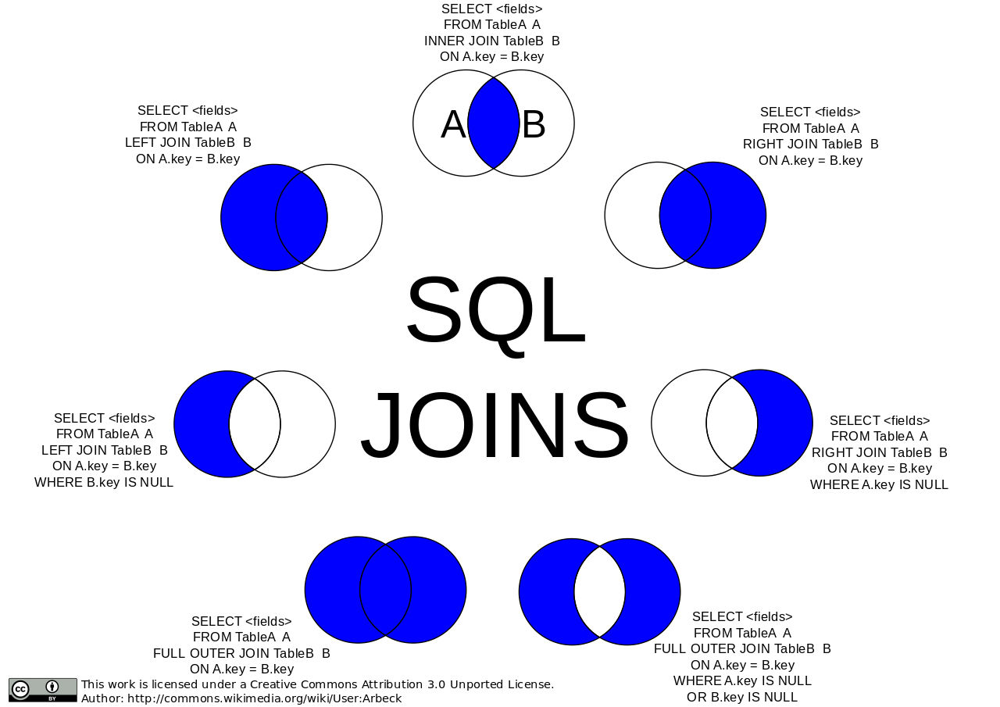

# **BDD4 - Langage SQL**

<a href="https://sasl56-my.sharepoint.com/:w:/g/personal/mickael_kerviche_sa-sl_fr/EaNYCjV5PN1KoKtEBdNzsZ4BxCGmC-oetJ_0PgZD9ZJBUQ?e=ppZReE
" target="_blank">Document de cours</a>

## Illustration des jointures

<a href="https://datascientest.com/tout-comprendre-des-jointures-sql">site à consulter</a>

