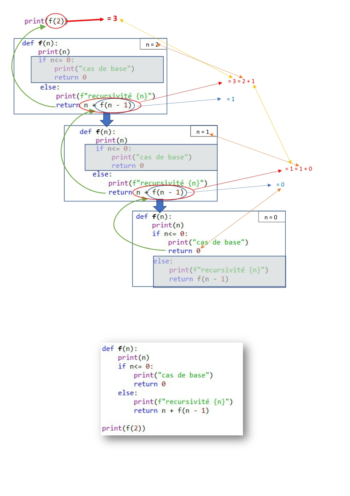

# **LP2 : Récursivité**

<a href="https://sasl56-my.sharepoint.com/:w:/g/personal/mickael_kerviche_sa-sl_fr/Ect6H56Xs_BFukpJMa6EWzgBWLn1Vy5JNnC_DegXxIAwAQ?e=hW5xIJ
" target="_blank">Introduction</a>

  
source: xkcd.com

<a href="https://sasl56-my.sharepoint.com/:w:/g/personal/mickael_kerviche_sa-sl_fr/EWWmxvSBnVlDhG2RpujcvgoB8FYqPRunecyU5JMQ3oQd1g?e=u9WH92
" target="_blank">Document de cours</a>

<a href="https://sasl56-my.sharepoint.com/:w:/g/personal/mickael_kerviche_sa-sl_fr/EcicT0EDW_JBrn-mfqOH6KYBA6cmzVRkrcu8fgWFuG4bAg?e=nj5rq2" target="_blank">Exercices</a>

<iframe width="800" height="500" frameborder="0" src="https://pythontutor.com/iframe-embed.html#code=def%20f%28n%29%3A%0A%20%20%20%20print%28n%29%0A%20%20%20%20if%20n%3C%3D%200%3A%0A%20%20%20%20%20%20%20%20print%28%22cas%20de%20base%22%29%0A%20%20%20%20%20%20%20%20return%200%20%20%0A%20%20%20%20else%3A%0A%20%20%20%20%20%20%20%20print%28f%22recursivit%C3%A9%20%7Bn%7D%22%29%0A%20%20%20%20%20%20%20%20return%20n%20%2B%20f%28n%20-%201%29%0A%20%20%20%20%0Af%282%29&codeDivHeight=400&codeDivWidth=350&cumulative=false&curInstr=20&heapPrimitives=nevernest&origin=opt-frontend.js&py=3&rawInputLstJSON=%5B%5D&textReferences=false"> </iframe>

[Exercices - Corrigé](exo_corrigé.md)