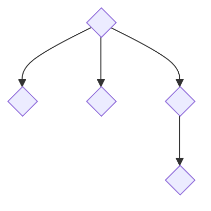

# Hauteur et taille d'un arbre

Dans tout le sujet, ici, **arbre** désigne un **arbre enraciné**.
> On rappelle que les arbres binaires ne sont pas des arbres enracinés.

On rappelle la définition d'un arbre : il s'agit d'une racine qui possède une étiquette et $0$, $1$ ou plusieurs sous-arbres qui sont des arbres. Un arbre enraciné qui ne possède pas de sous-arbre est appelé feuille.

On modélise **ici** des arbres enracinés **sans étiquette** par des listes Python : la liste des sous-arbres.

!!! tip "Utilisation"
    Cette modélisation permet d'écrire des constructions du genre

    ```python
    for sous_arbre in arbre:
        action(sous_arbre)
    ```

    Ou alors des listes en compréhension

    ```python
    [action(sous_arbre) for sous_arbre in arbre]
    ```

**Dans cet exercice**, la définition de la hauteur d'un arbre est le nombre maximal de filiation pour rejoindre la racine à une feuille.

- Une feuille est donc modélisée par `[]` ; sa hauteur est zéro.
- L'arbre représenté par `[[], [], [[]]]` se dessine ainsi ; sa hauteur est $2$ : 




Écrire deux fonctions telles que :

- `hauteur(arbre)` renvoie la hauteur de l'arbre enraciné donné en paramètre.
- `taille(arbre)` renvoie la taille de l'arbre enraciné donné en paramètre.

> Dans cet exercice, on pourra utiliser les fonctions prédéfinies `max` et `sum`.

!!! example "Exemples"

    ```pycon
    >>> hauteur([])
    0
    >>> hauteur([[], [], [[]]])
    2
    ```
    ```pycon
    >>> taille([])
    1
    >>> taille([[], [], [[]]])
    5
    ```

{{ IDE('exo') }}
