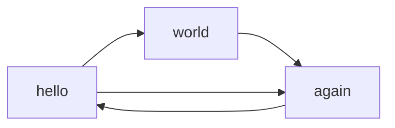

# <h1 class='titre'>Titre H1</h1>
## <h2 class='titre'>Titre H2</h2>
### Titre H3
#### Titre H4

> Blockquote  
> Début de ligne avec '> '

```mermaid
graph LR
    hello --> world
    world --> again
    again --> hello
    hello --> again
```